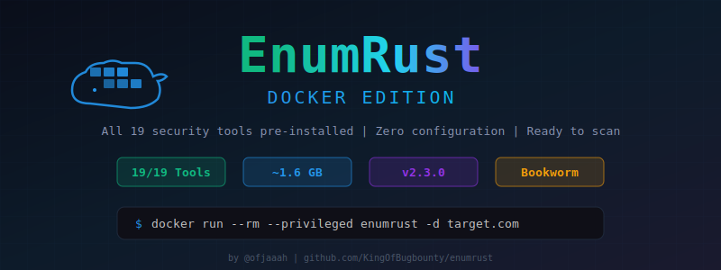

# 🐳 EnumRust - Docker Guide

<div align="center">



**Run EnumRust with all 19 security tools pre-installed - zero configuration required**

[](#-quick-start)
[](#-pre-installed-tools)

</div>

---

## 📋 Table of Contents

- [Quick Start](#-quick-start)
- [Building the Image](#-building-the-image)
- [Running Scans](#-running-scans)
- [Dashboard Mode](#-dashboard-mode)
- [Bug Bounty Mode](#-bug-bounty-mode)
- [Infrastructure Scanning](#-infrastructure-scanning)
- [Volume Mounts & Persistence](#-volume-mounts--persistence)
- [Environment Variables](#-environment-variables)
- [Pre-installed Tools](#-pre-installed-tools)
- [Network Configuration](#-network-configuration)
- [Examples](#-examples)
- [Troubleshooting](#-troubleshooting)

---

## 🚀 Quick Start

```bash
# 1. Clone and build
git clone https://github.com/KingOfBugbounty/enumrust.git
cd enumrust
docker build -t enumrust .

# 2. Verify all tools are installed
docker run --rm enumrust --check-tools

# 3. Run your first scan
docker run --rm --privileged \
  -v $(pwd)/results:/results \
  enumrust -d example.com --subfinder --full-scan
```

---

## 🔨 Building the Image

### Standard Build

```bash
docker build -t enumrust .
```

### Build with Custom Tag

```bash
docker build -t enumrust:2.3.0 .
```

### Build with No Cache (fresh rebuild)

```bash
docker build --no-cache -t enumrust .
```

> **Build Time:** ~10-15 minutes (compiles Rust binaries + 15 Go tools)
>
> **Image Size:** ~1.6 GB (optimized multi-stage build with cleanup)

### What the Build Does

1. **Stage 1 (Builder)** - Compiles `enumrust`, `regen_report`, and `feroxbuster` from Rust source
2. **Stage 2 (Runtime)** - Installs all 19 security tools, nuclei templates, then removes build dependencies

---

## 🔍 Running Scans

### Basic Domain Scan

```bash
docker run --rm --privileged \
  -v $(pwd)/results:/results \
  enumrust -d target.com --subfinder
```

### Full Scan (all modules)

```bash
docker run --rm --privileged \
  -v $(pwd)/results:/results \
  enumrust -d target.com --subfinder --full-scan
```

### Scan from File (multiple targets)

```bash
docker run --rm --privileged \
  -v $(pwd)/results:/results \
  -v $(pwd)/targets.txt:/targets.txt \
  enumrust -f /targets.txt --full-scan
```

### Custom Workers

```bash
docker run --rm --privileged \
  -v $(pwd)/results:/results \
  enumrust -d target.com --subfinder --full-scan --workers 20
```

---

## 📊 Dashboard Mode

Start the web dashboard for real-time scan monitoring:

```bash
docker run --rm --privileged \
  -p 8080:8080 \
  -v $(pwd)/results:/results \
  enumrust -d target.com --dashboard --full-scan
```

### Custom Dashboard Port

```bash
docker run --rm --privileged \
  -p 3000:3000 \
  -v $(pwd)/results:/results \
  enumrust -d target.com --dashboard --dashboard-port 3000 --full-scan
```

### Dashboard Only (no scan)

```bash
docker run --rm \
  -p 8080:8080 \
  -v $(pwd)/results:/results \
  enumrust --dashboard
```

### Accessing the Dashboard

1. Open `http://localhost:8080` in your browser
2. Use the **Setup Code** displayed in the terminal output
3. Create your username and password
4. Monitor scans in real-time

---

## 🎯 Bug Bounty Mode

### Basic Bug Bounty Scan

```bash
docker run --rm --privileged \
  -v $(pwd)/results:/results \
  enumrust -d target.com --bugbounty
```

### With Discord Notifications

```bash
docker run --rm --privileged \
  -v $(pwd)/results:/results \
  enumrust -d target.com \
    --bugbounty \
    --discord-webhook "https://discord.com/api/webhooks/YOUR_ID/YOUR_TOKEN"
```

### Aggressive Bug Bounty + Dashboard

```bash
docker run --rm --privileged \
  -p 8080:8080 \
  -v $(pwd)/results:/results \
  enumrust -d target.com \
    --bugbounty \
    --full-scan \
    --workers 20 \
    --dashboard \
    --discord-webhook "https://discord.com/api/webhooks/YOUR_ID/YOUR_TOKEN"
```

**Bug Bounty Mode includes:**
- Admin panel discovery on 15 ports
- Default credential testing (40+ combos)
- Discord alerts for valid credentials
- Critical vulnerability notifications
- Detailed reports for bug submissions

---

## 🏗️ Infrastructure Scanning

### Single IP

```bash
docker run --rm --privileged \
  -v $(pwd)/results:/results \
  enumrust --infraestrutura --ip-range 192.168.1.100
```

### CIDR Range

```bash
docker run --rm --privileged \
  -v $(pwd)/results:/results \
  enumrust --infraestrutura --ip-range 192.168.1.0/24
```

### IP Range

```bash
docker run --rm --privileged \
  -v $(pwd)/results:/results \
  enumrust --infraestrutura --ip-range 10.0.0.1-10.0.0.254
```

### Multiple IPs

```bash
docker run --rm --privileged \
  -v $(pwd)/results:/results \
  enumrust --infraestrutura --ip-range 192.168.1.1,192.168.1.5,192.168.1.10
```

---

## 📁 Volume Mounts & Persistence

### Results Directory

All scan results are saved to `/results` inside the container. Mount a local directory to persist results:

```bash
-v $(pwd)/results:/results
```

### Target Files

Mount target lists from your host:

```bash
-v $(pwd)/targets.txt:/targets.txt
```

### Custom Wordlists

Mount custom wordlists for directory bruteforcing:

```bash
-v $(pwd)/my-wordlist.txt:/opt/enumrust/wordlist.txt
```

### Full Example with Multiple Mounts

```bash
docker run --rm --privileged \
  -p 8080:8080 \
  -v $(pwd)/results:/results \
  -v $(pwd)/targets.txt:/targets.txt \
  -v $(pwd)/wordlist.txt:/opt/enumrust/wordlist.txt \
  enumrust -f /targets.txt --full-scan --dashboard
```

---

## 🌐 Environment Variables

| Variable | Description | Default |
|----------|-------------|---------|
| `ENUMRUST_WORKERS` | Number of concurrent workers | `10` |

---

## 🧰 Pre-installed Tools

The Docker image comes with **all 19 tools** ready to use:

### Core Tools (Required)

| Tool | Version | Description |
|------|---------|-------------|
| **httpx** | latest | HTTP probing and validation |
| **dnsx** | latest | DNS resolution and validation |
| **nuclei** | v3.x | Vulnerability scanner with templates |
| **masscan** | apt | Fast port scanner |

### Discovery Tools

| Tool | Description |
|------|-------------|
| **subfinder** | Passive subdomain enumeration |
| **haktrails** | SecurityTrails integration |
| **tlsx** | TLS/SSL certificate analysis |

### Fuzzing Tools

| Tool | Description |
|------|-------------|
| **ffuf** | Fast web fuzzer |
| **feroxbuster** | Recursive directory brute-forcer |

### Crawling Tools

| Tool | Description |
|------|-------------|
| **hakrawler** | Web crawler for URL discovery |
| **urlfinder** | Passive URL discovery |
| **katana** | Fast web crawler |
| **gau** | Fetch URLs from web archives |
| **waybackurls** | Fetch URLs from Wayback Machine |

### Security & Utils

| Tool | Description |
|------|-------------|
| **trufflehog** | Secret/credential scanner |
| **anew** | Append unique lines to files |
| **jq** | JSON processor |
| **whois** | Domain registration lookup |
| **tmux** | Terminal multiplexer |

### Verify Installation

```bash
docker run --rm enumrust --check-tools
```

Expected output:
```
  Tools found: 19/19
  ✓ All core tools installed!
```

---

## 🔧 Network Configuration

### Privileged Mode

`--privileged` is required for **masscan** (raw socket access for SYN scans):

```bash
docker run --rm --privileged ...
```

### Without Privileged Mode

If you don't need port scanning, you can run without `--privileged`:

```bash
docker run --rm \
  -v $(pwd)/results:/results \
  enumrust -d target.com --subfinder
```

### Host Network Mode

For scans that need full network access:

```bash
docker run --rm --privileged \
  --net=host \
  -v $(pwd)/results:/results \
  enumrust -d target.com --full-scan
```

---

## 📝 Examples

### 1. Quick Subdomain Enumeration

```bash
docker run --rm \
  -v $(pwd)/results:/results \
  enumrust -d example.com --subfinder
```

### 2. Full Recon Pipeline

```bash
docker run --rm --privileged \
  -p 8080:8080 \
  -v $(pwd)/results:/results \
  enumrust -d target.com \
    --subfinder \
    --full-scan \
    --dashboard
```

### 3. Bug Bounty with All Features

```bash
docker run --rm --privileged \
  -p 8080:8080 \
  -v $(pwd)/results:/results \
  enumrust -d target.com \
    --bugbounty \
    --full-scan \
    --workers 15 \
    --dashboard \
    --discord-webhook "https://discord.com/api/webhooks/..."
```

### 4. Internal Network Assessment

```bash
docker run --rm --privileged \
  --net=host \
  -v $(pwd)/results:/results \
  enumrust --infraestrutura --ip-range 10.0.0.0/24
```

### 5. Batch Scan from File

```bash
# Create targets file
echo -e "target1.com\ntarget2.com\ntarget3.com" > targets.txt

# Run batch scan
docker run --rm --privileged \
  -v $(pwd)/results:/results \
  -v $(pwd)/targets.txt:/targets.txt \
  enumrust -f /targets.txt --full-scan
```

### 6. IP Scan with Directory Fuzzing

```bash
docker run --rm --privileged \
  -v $(pwd)/results:/results \
  enumrust -d target.com --ip-scan --ip-full-scan
```

---

## 📂 Output Structure

Results are saved in `/results/<domain>/` (mounted to your host):

```
results/
└── example.com/
    ├── subdomains.txt          # Discovered subdomains
    ├── ips.txt                 # Resolved IP addresses
    ├── http200.txt             # Active HTTP(S) hosts
    ├── masscan.txt             # Port scan results
    ├── ports.txt               # Validated open ports
    ├── nuclei.txt              # Vulnerability findings
    ├── urls.txt                # Discovered URLs
    ├── js_endpoints.txt        # JavaScript endpoints
    ├── js_secrets.txt          # Potential secrets in JS
    ├── s3.txt                  # S3 bucket URLs
    ├── ferox_200_only.txt      # Directory bruteforce results
    ├── all_results.txt         # Consolidated report
    ├── current_status.json     # Scan status
    ├── progress.jsonl          # Real-time progress log
    └── metrics.json            # Performance metrics
```

---

## 🐛 Troubleshooting

### "GLIBC not found" Error

The image uses `debian:bookworm-slim`. If you see glibc errors, rebuild with `--no-cache`:

```bash
docker build --no-cache -t enumrust .
```

### masscan Permission Denied

You need `--privileged` for raw socket access:

```bash
docker run --rm --privileged ...
```

### Results Not Appearing on Host

Make sure you mount the volume correctly:

```bash
-v $(pwd)/results:/results    # Correct
-v ./results:/results          # Also works
```

### Dashboard Not Accessible

Ensure you expose the port:

```bash
-p 8080:8080    # Map host:container port
```

If using `--dashboard-port 3000`, match the mapping:

```bash
-p 3000:3000 ... --dashboard --dashboard-port 3000
```

### Container Runs Out of Memory

For large scans, increase Docker memory limit:

```bash
docker run --rm --privileged \
  --memory=4g \
  -v $(pwd)/results:/results \
  enumrust -d large-target.com --full-scan
```

### Check Tool Versions

```bash
docker run --rm enumrust --check-tools
```

---

## 🏷️ Image Details

| Property | Value |
|----------|-------|
| **Base Image** | `debian:bookworm-slim` |
| **Build Stage** | `rust:bookworm` |
| **Image Size** | ~1.6 GB |
| **Go Version** | 1.24.4 |
| **Tools** | 19/19 pre-installed |
| **Nuclei Templates** | Auto-updated at build time |
| **Working Directory** | `/results` |
| **Exposed Port** | `8080` (dashboard) |
| **Entrypoint** | `enumrust` |

---

<div align="center">

**[Back to Main README](README.md)** | **[Bug Bounty Guide](BUGBOUNTY_MODE.md)**

Made with 🐳 + 🦀

</div>
